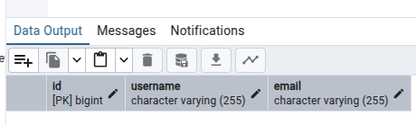
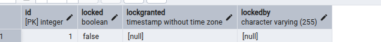
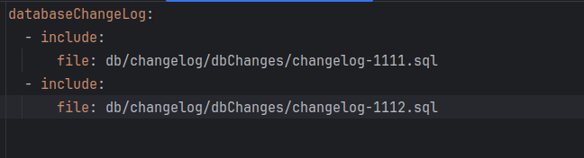
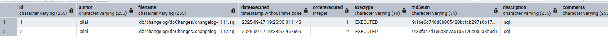
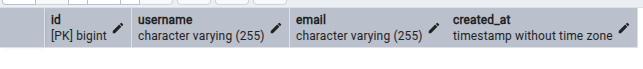

**Basic Introduction**
------------------

Q. What is Liquibase ?

A. Open-Source database schema management and versioning tool !

Q. Why do we need it ?

A. To maintain diff versions of db schema !

Q. How Does It Work ?

A. The change that you need should be done in a file and this file should be made available to db.changelog-master file !

NOTE : I have kept master file as yaml and other changelog files as sql, although we can have other formats as well.

**====Explanation====**

We have a file named db.changelog-master.yml as the name suggests this is a master file.

Below are the contents of a simple master file.

What does above content means for liquibase engine ?

databaseChangeLog:
This is the root element of a Liquibase changelog master file.
It tells Liquibase that this file contains a list of changes or references to other files(changelog files) that have actual changes to be implemented.

include:
Instead of writing all changes directly inside this file, Liquibase allows you to include other changelog files.
This is useful for organizing migrations into smaller files instead of having one giant changelog. 

file: db/changelog/dbChanges/changelog-UniqueId.sql
This specifies the relative path to another changelog file.
Liquibase will load changelog-JiraId.sql and process the changesets inside it.
Path is relative to the root changelog (db.changelog-master.yml).

We can have multiple changelog files.
Note : changelog-1 can be replaced by any uniqueId.

-------------------------
ChangeLog File Explained

1.changelog-1111.sql

--changeset bilal:1
bilal -> the author. Usually your name/initials/team ID.
1 -> the id of the changeset (must be unique per author).
Together (bilal:1) uniquely identifies this change.
CREATE TABLE users ...
Actual SQL that runs when this changeset is executed.
It will create a table named users.

2. When App runs for above changeset it creates 3 tables

2.1 user

2.2 databasechangelog

2.3 databasechangeloglock

databasechangelog has entries for author changesetId as primary key filename and checksum.

**Executing For Second Changeset File**

A change is required in db.changelog-master.yml

--changeset bilal:2
Marks the start of another changeset, also written by bilal, but with id 2.
Even though both are in the same file, Liquibase treats them as separate tracked changes.
ALTER TABLE users ADD email VARCHAR(255);
Adds a new column email to the already-created users table.

**2 tables undergo a change when above changset is executed.**

1. databasechangelog tabel that keeps entries for all changesets

2. user table which now has a new column

